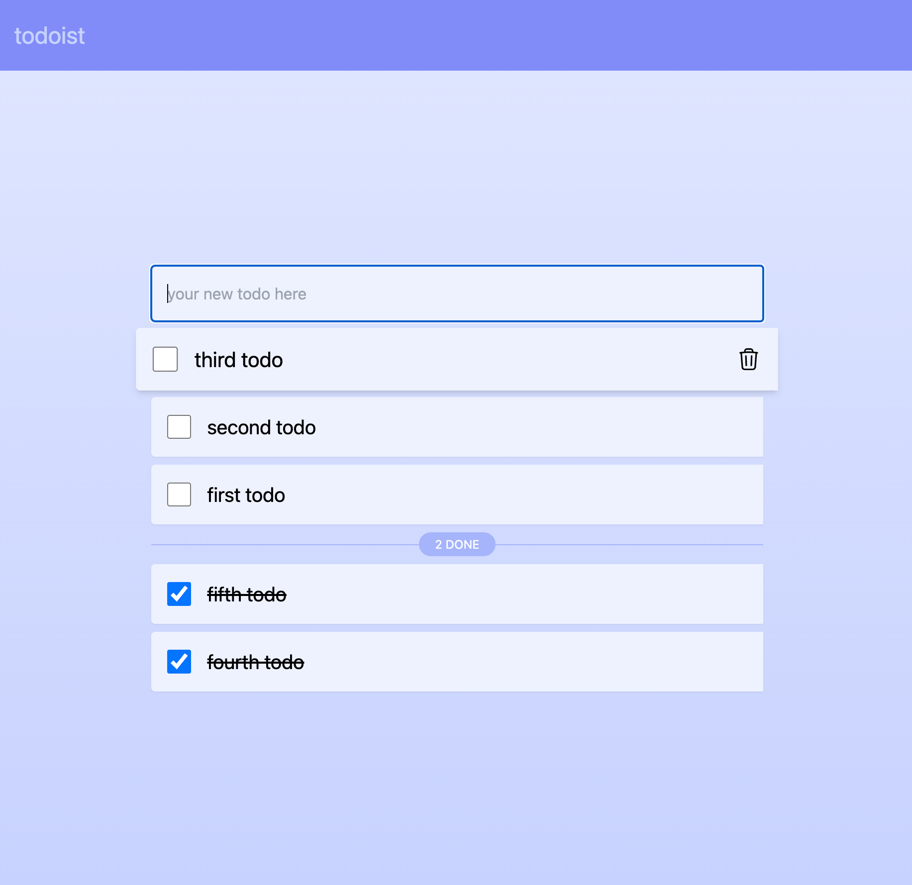

# bun-htmx-simple-todo

This is the result of playing around with [Bun](https://bun.sh/), [Elysia](https://elysiajs.com/), [TailwindCSS](https://tailwindcss.com/) and [HTMX](https://htmx.org/). Nothing fancy, just playing with tech and essentially a port of [gofiber-htmx-simple-todo](https://github.com/Tmw/gofiber-htmx-simple-todo).

## Getting started

```console
git clone git@github.com:Tmw/bun-htmx-simple-todo.git
cd bun-htmx-simple-todo
bun install
bun run start
```

## Screenshot



## License

[MIT](./LICENSE)
